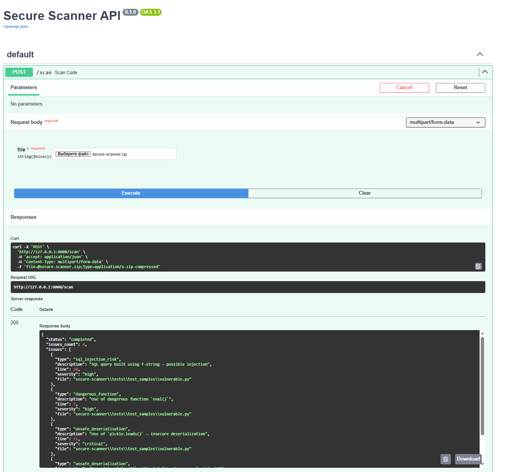

# Secure Scanner

Статический анализатор кода и зависимостей для Python, который обнаруживает:

- **SQL-инъекции** через f-строки  
- **Опасные функции**: `eval`, `exec`  
- **Небезопасную десериализацию**: `pickle.loads`, `yaml.load`  
- **Известные уязвимости в зависимостях** (CVE/GHSA через [OSV](https://osv.dev))

Поддерживает как классический `requirements.txt`, так и современный `pyproject.toml` (PEP 621 и Poetry).

Результаты выводятся в удобочитаемом текстовом формате или в стандарте **SARIF** для интеграции в CI/CD (например, GitHub Actions).

## Использование

```bash
# Анализ проекта (автоматически проверит и код, и зависимости)
python -m scanner --path .

# Анализ тестового набора
python -m scanner --path ./tests/test_samples

# Вывод в формате SARIF (для GitHub Actions, GitLab и др.)
python -m scanner --path . --format sarif
```
Сканер также доступен как веб-сервис на FastAPI. Запустите:

```bash
pip install -r requirements.txt
uvicorn scanner.api:app --reload
```
